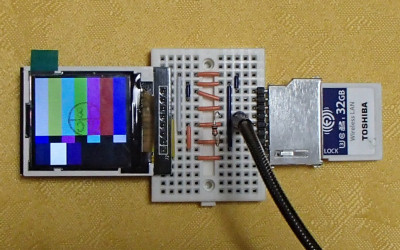

# FlashAir-SlibST7735

Lua library for TFT display modules with ST7735 for FlashAir.  
 

## Tested equipment

Tested on the following TFT display module and FlashAir W-04 v4.00.03.  

 1.44inch with ST7735 V1.1 |  1.44inch with ST7735 V2.1
--- | ---
128*128 offset=(2,1) gs=0 | 128*128 offset=(0,0) gs=3 
 |   
 | 

## FlashAir to TFT module connections

Please choose your favorite TYPE.

### Rename table

this text | module pin
--- | ---
SCL| CLK or SCK or SCL
SDA| SDI or SDA
DCX| RS  or A0  or DC
CSX or CSX2| CS
RESX|RST or RESET or RES
LED| LED or LEDA  or BLK
GND| GND 
VCC| VCC
 
### TYPE list

FlashAir|TYPE1|TYPE2|TYPE3|TYPE4|TYPE21|TYPE22|TYPE23
--- | --- | --- | --- | --- | --- | --- | ---
---  |w/Reset|w/PIO|w/LED|w/SPI|primaly|secondary|twin
CMD  |SDA |SDA |SDA |SDA/DO |SDA   |SDA  |SDA
DAT0 |SCL |SCL |SCL |SCL/CLK|SCL   |SCL  |SCL
DAT1 |DCX |DCX |DCX |DCX/-- |DCX   |DCX  |DCX
DAT2 |CSX |CSX |CSX |CSX/DI |CSX   |(CSX)|CSX
DAT3 |RESX|PIO |LED |-- /CS |(CSX2)|CSX2 |CSX2

*TYPE21,TYPE22,TYPE23 for two display*

### TYPE1  
Module Reset is hardwere reset.  

FlashAir(Pin#) | ST7735 TFT | Power | comment
--- | --- | --- | ---
CLK (5) |--- |Pull-down(10korm) to GND
CMD (2) |SDA |
DAT0(7) |SCL |
DAT1(8) |DCX |
DAT2(9) |CSX |
DAT3(1) |RESX|
---     |LED |3.3V|
VCC (4) |VCC |3.3V   
VSS(3,6)|GND |GND    

### TYPE2  
DAT3 of FlashAir can be used for PIO.  

FlashAir(Pin#) | ST7735 TFT | Power | comment
--- | --- | --- | ---
CLK (5) |--- |Pull-down(10korm) to GND
CMD (2) |SDA |
DAT0(7) |SCL |
DAT1(8) |DCX |
DAT2(9) |CSX |
DAT3(1) |PIO |
---     |RESX|Pull-up(10korm) to 3.3V
---     |LED |3.3V
VCC (4) |VCC |3.3V
VSS(3,6)|GND |GND

### TYPE3  
DAT3 of FlashAir for LED backlight on/off control.  

FlashAir(Pin#) | ST7735 TFT | Power | comment
--- | --- | --- | ---
CLK (5) |--- |Pull-down(10korm) to GND
CMD (2) |SDA |
DAT0(7) |SCL |
DAT1(8) |DCX |
DAT2(9) |CSX |
DAT3(1) |LED ||connect through 10kohm
---     |RESX|Pull-up(10korm) to 3.3V
VCC (4) |VCC |3.3V
VSS(3,6)|GND |GND 

### TYPE4  
CMD,DAT0,DAT2,DAT3 can be used for SPI.

FlashAir(Pin#) | ST7735 TFT | SPI device | Power | comment
--- | --- | --- | --- | ---
CLK (5) |--- |---| Pull-down(10korm) to GND
CMD (2) |SDA |DO |
DAT0(7) |SCL |CLK|
DAT1(8) |DCX |---|
DAT2(9) |CSX |DI | Pull-up(10korm) to 3.3V
DAT3(1) |--- |CS |
---     |RESX|---| Pull-up(10korm) to 3.3V
---     |LED |---| 3.3V
VCC (4) |VCC |VCC| 3.3V
VSS(3,6)|GND |GND| GND

### TYPE21
If you connect two displays, use this for primaly display.

FlashAir(Pin#) | ST7735 TFT | Power | comment
--- | --- | --- | ---
CLK (5) |--- | Pull-down(10korm) to GND
CMD (2) |SDA |
DAT0(7) |SCL |
DAT1(8) |DCX |
DAT2(9) |CSX | Pull-up(10korm) to 3.3V
DAT3(1) |(CSX2)|
---     |RESX| Pull-up(10korm) to 3.3V
---     |LED | 3.3V
VCC (4) |VCC | 3.3V
VSS(3,6)|GND | GND

### TYPE22  
If you connect two displays, use this for secondaly display.

FlashAir(Pin#) | ST7735 TFT | Power | comment
--- | --- | --- | ---
CLK (5) |--- | Pull-down(10korm) to GND
CMD (2) |SDA |
DAT0(7) |SCL |
DAT1(8) |DCX |
DAT2(9) |(CSX)| Pull-up(10korm) to 3.3V
DAT3(1) |CSX2|
---     |RESX| Pull-up(10korm) to 3.3V
---     |LED | 3.3V
VCC (4) |VCC | 3.3V
VSS(3,6)|GND | GND

### TYPE23  
If you connect two identical displays, use this for twin display.
You can draw each or both.

FlashAir(Pin#) | ST7735 TFT1 | ST7735 TFT2 | Power | comment
--- | --- | --- | --- | ---
CLK (5) |--- |--- | Pull-down(10korm) to GND
CMD (2) |SDA |SDA |
DAT0(7) |SCL |SCL |
DAT1(8) |DCX |DCX |
DAT2(9) |CSX |--- | Pull-up(10korm) to 3.3V
DAT3(1) |--- |CSX2|
---     |RESX|RESX| Pull-up(10korm) to 3.3V
---     |LED |LED | 3.3V
VCC (4) |VCC |VCC | 3.3V
VSS(3,6)|GND |GND | GND

## Install

SlibST7735.lua -- Copy to somewhere in Lua's search path.

## Color format of functions

color   : BBBBB_GGGGGG_RRRRR (64K(16bpp) color)  
bgcolor : BBBBB_GGGGGG_RRRRR (64K(16bpp) back ground color)

## Internal bitmap data format

    -- same as FlashAir-SlibBMP.lua
    bitmap  = {}  
    bitmap.header -- copyed from BMP header  
    bitmap.width  -- bitmap width  
    bitmap.height -- bitmap height  
    bitmap.bit    -- bpp, 16(BBBBB_GGGGGG_RRRRR format)
    bitmap.flat   -- 1:Flat(Stuffing without leaving spaces for small image), 0:Stored in an array for each line.  
    bitmap.data   -- bitmap data  

## Internal font data format

    -- example --
    font74 = {
    height= 7;
    width = 4;
    [' '] ={0x00,0x00,0x00,0x00};
    ['!'] ={0x00,0x2F,0x00,0x00};
    ['"'] ={0x03,0x00,0x03,0x00};
    --
    ['~'] ={0x0C,0x04,0x06,0x00};
    }

## Usage
### Sample of init()

 1.44inch with ST7735 V1.1 |
--- |
 |

1.44inch with ST7735 V2.1 |
--- |
 |

### Description of the command

command | description
--- | ---
ST7735:init(type,rotate,xSize,ySize,rOffset,dOffset,gm) | Parameter initialization and reset LCD module. **type:** 1:D3=RST,  2:D3=PIO, 3:D3=LED, 4:with SPI, 21:primaly, 22:secondaly, 23:twin   See module connections information. **rotate:** 0:Vertical default, 1:Horizontal default, 2:Vertical reverse, 3:Horizontal reverse **xSize,ySize:** LCD x size, y size **rOffset,dOffset:** RAM address offset **gm:** module GM pad
ST7735:flip(rFlip,dFlip) | Filp x-axis or y-axis for graphic writing. **rFlip,dFlip:** 0:normal, 1:flip
tbl=ST7735:duplicate() | Duplicate ST7735 library, if you use two deferent TFT module of ST7735 or rotation. **return:** duplicated table of library.
ST7735:writeStart([flag]) | Enable control. **flag:** 1:primaly, 2:secondly, 3:both default is 2 at TYPE22, 3 at TYPE23, 1 at others.
ST7735:writeEnd()   | Disable control.
ST7735:cls()        | Clear screen.
ST7735:dspOn()      | Display contents of RAM.
ST7735:dspOff()     | Do not display contents of RAM.
ST7735:pset(x,y,color) | Plot point at (x,y).
ST7735:line(x1,y1,x2,y2,color) | Plot line (x1,y1)-(x2,y2).
ST7735:box(x1,y1,x2,y2,color) | Plot box (x1,y1)-(x2,y2).
ST7735:boxFill(x1,y1,x2,y2,color) | Plot filled box (x1,y1)-(x2,y2).
ST7735:circle(x,y,xr,yr,color) | Plot circle of center(x,y), radius(xr,yr).
ST7735:circleFill(x,y,xr,yr,color) | Plot filled circle of center(x,y), radius(xr,yr).
ST7735:put(x,y,bitmap) | Put 16bpp bitmap at upper left coordinates with (x,y).
ST7735:put2(x,y,bitmap)| Put 16bpp flat bitmap faster at upper left coordinates with (x,y).
ST7735:locate(x,y,mag,color,bgcolor,font) | Locate cursor, set print area(x,y)-(xSize-1,ySize-1), attributions and font. If you do not want to change any arguments you can substitute nil.
x,y=ST7735:print(str) | Print alphabets and return next cursor position.
x,y=ST7735:println(str) | Print alphabets, creates a new line and return next cursor position.
ST7735:ledOn() | LED backlight ON at TYPE2.
ST7735:ledOff() | LED backlight OFF at TYPE2.
ret=ST7735:pio(ctrl,data) | PIO control of DAT3 at TYPE3. PIO default is input. **ctrl:** 0:input, 1:output. data: value for output **return:** input value or nil at TYPE1
ST7735:spiInit(period,mode,bit,cstype)|SPI init for TYPE4. **period,mode,bit:** same as fa.spi(...) **cstype:** 0:low enable, 1:high enable, 2:always High-Z
res = ST7735:spiWrite(data_num) res = ST7735:spiWrite(data_str,xfer_num)|SPI write for TYPE4. **data_num,data_str,xfer_num,res:** same as fa.spi("write", ...)
res_num = ST7735:spiRead() res_tbl = ST7735:spiRead(xfer_num,data_num)|SPI read for TYPE4. **xfer_num,data_num,res_num,res_tbl:** same as fa.spi("read", ...)

## Sample program

 

>sample.lua       `-- draw graphics demo`  
>sample_dual.lua  `-- graphics demo of twin LCD`  
>sample_eyes.lua  `-- Caterpillar eyes move demo of twin LCD`  
>lib/SlibST7735.lua  
>lib/SlibBMP.lua  `-- Copy from FlashAir-SlibBMP repository`  
>img/balloon01.bmp  
>font/font74.lua  

These files copy to somewhere in FlashAir.

## Licence

[MIT](https://github.com/AoiSaya/FlashAir-libBMP/blob/master/LICENSE)

## Author

[GitHub/AoiSaya](https://github.com/AoiSaya)  
[Twitter ID @La_zlo](https://twitter.com/La_zlo)
